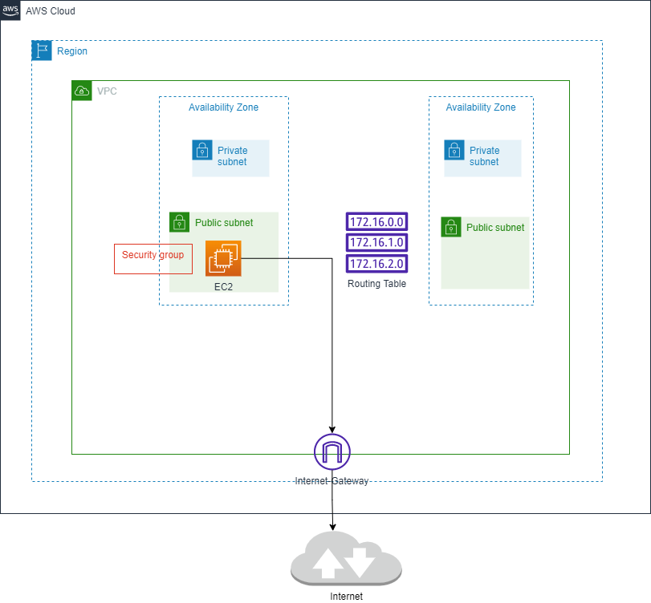

# play-terraform-aws-vpc

## Mục tiêu
```
- tạo vpc
  + subnet
  + routing table
  + internet gatway
  + nat gateway
  + elacstic ip
  + security group
- tạo IAM Role
- tạo ec2
- hiểu hơn về data source
- hiểu hơn về terraform.tfvars: set giá trị đầu vào cho biến

```

## High level diagram



### Ref

1.Ashish Patel
```
https://medium.com/devops-mojo/terraform-provision-amazon-eks-cluster-using-terraform-deploy-create-aws-eks-kubernetes-cluster-tf-4134ab22c594
```

2.LEON LEVY
```
https://www.ahead.com/resources/how-to-create-custom-ec2-vpcs-in-aws-using-terraform/
https://github.com/bugbiteme/demo-tform-aws-vpc
```
3.Sourav Kundu
```
https://skundunotes.com/2021/11/16/attach-iam-role-to-aws-ec2-instance-using-terraform/
https://github.com/kunduso/ec2-userdata-terraform/tree/add-iam-role
```